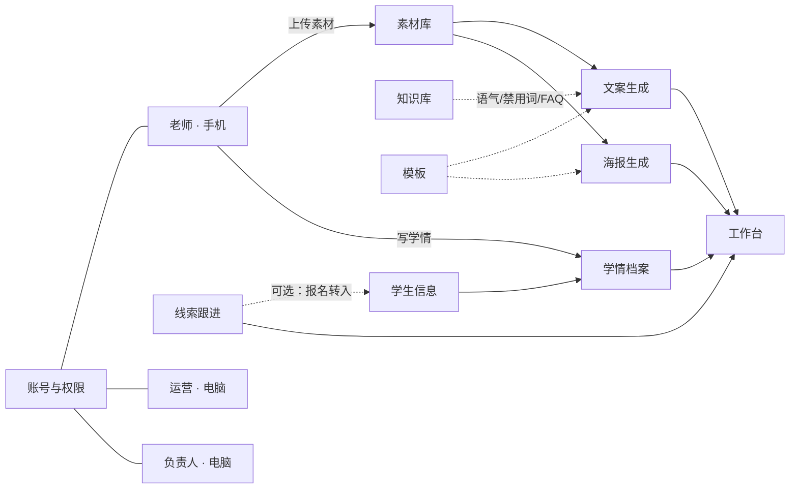
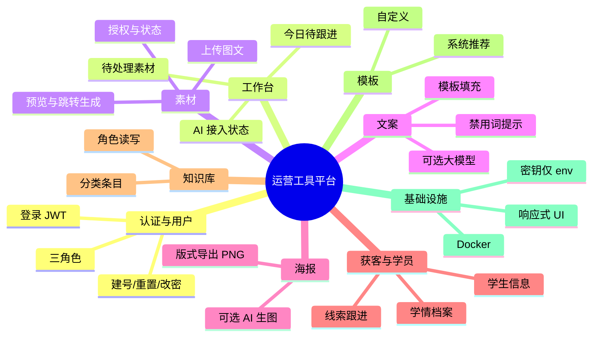
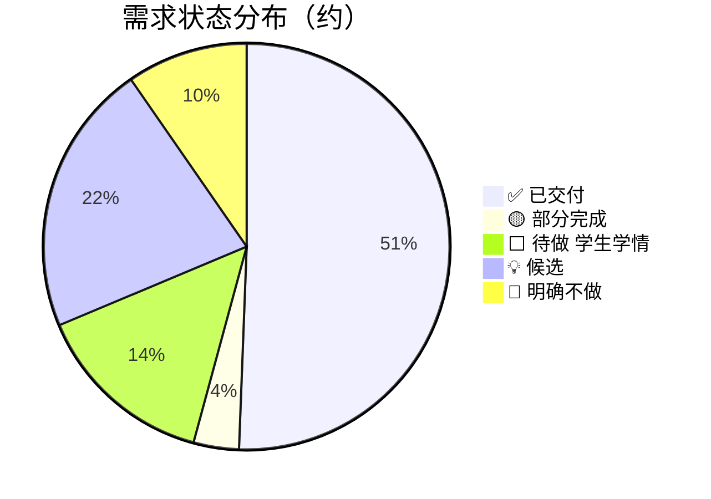
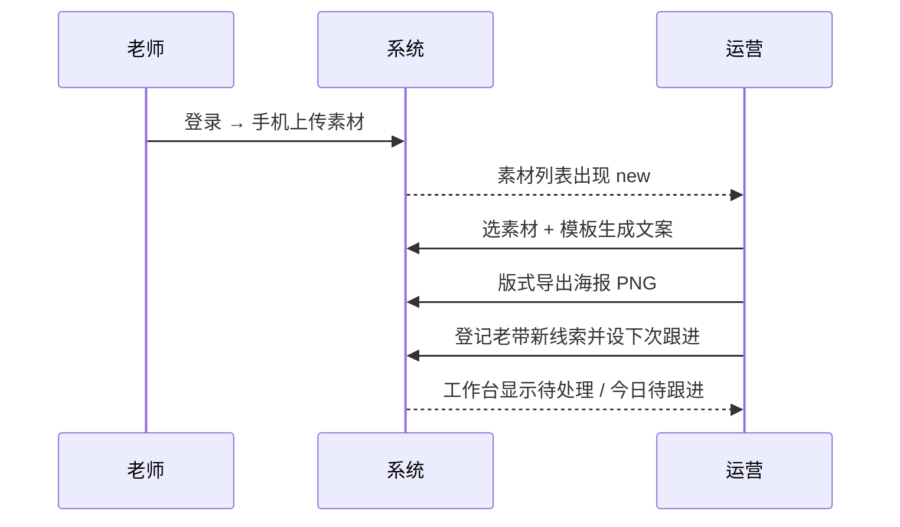
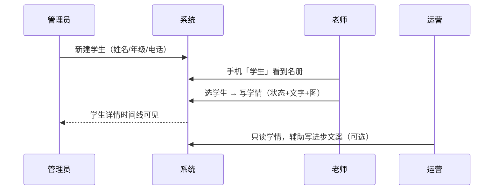
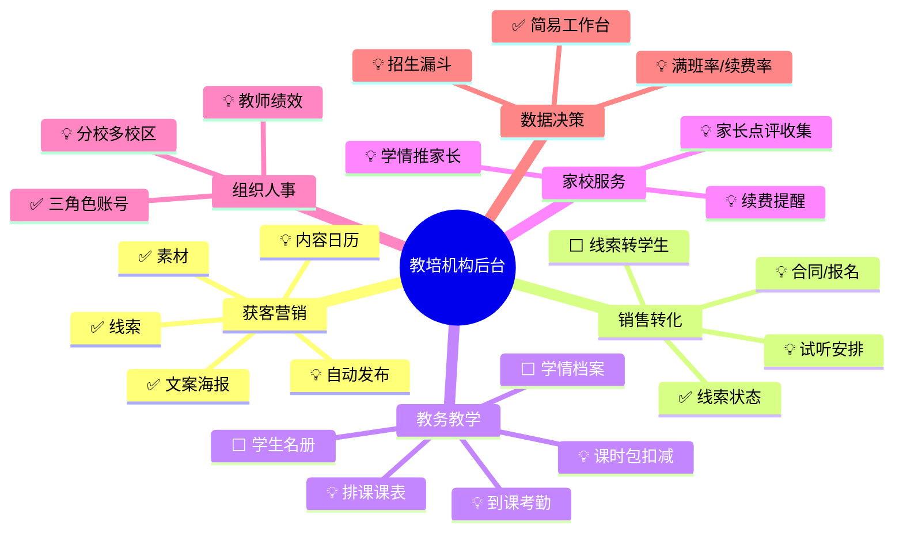

# 壹号教室运营工具平台 · 需求清单

> **文档用途：** 产品需求的「单一事实来源」。后续增删、改优先级、拆分/合并需求，直接改本文件即可。  
> **关联规格：** [V1 设计规格](./superpowers/specs/2026-07-28-one-class-ops-platform-design.md) · [认证细化](./superpowers/specs/2026-07-29-auth-element-ui-rebuild-design.md) · [米金 UI](./superpowers/specs/2026-07-29-mijin-luxury-ui-polish-design.md) · [学生与学情](./superpowers/specs/2026-07-29-students-learning-records-design.md)  
> **运行说明：** [README-ops-platform.md](../README-ops-platform.md)  
> **最后更新：** 2026-07-29（加入学生信息 + 学情档案规划）

---

## 怎么用这份文档

| 你想做的事 | 操作方式 |
|-----------|---------|
| **看全貌** | 看下方「模块全景」与「状态一览」 |
| **加需求** | 在对应模块表格末尾加一行，分配新 ID（如 `REQ-MAT-06`），状态先标 `💡 候选` |
| **删需求** | 不要直接抹掉：把状态改为 `❌ 废弃`，在「变更记录」写原因（方便回溯） |
| **优化需求** | 改「描述 / 验收标准 / 优先级」，并在变更记录记一笔 |
| **排期** | 改「版本」列（`V1` / `V1.1` / `V2` / `以后`）与「优先级」 |
| **对照实现** | 「状态」列：`✅ 已交付` / `🟡 部分完成` / `⬜ 待做` / `💡 候选` / `🚫 明确不做` / `❌ 废弃` |

### 字段约定

| 字段 | 说明 |
|------|------|
| **ID** | 稳定编号，格式 `REQ-<模块缩写>-<两位序号>`，**不要复用已废弃 ID** |
| **优先级** | `P0` 主闭环必须 · `P1` 重要体验 · `P2` 增强 · `P3` 以后再说 |
| **版本** | 计划落入哪一版；与是否已实现无关 |
| **状态** | 当前落地情况（见上表） |
| **角色** | 主要使用者：`admin` / `operator` / `teacher` / `全部` |

---

## 1. 产品一句话

机构内部工具：两条主线并行——

1. **获客运营：** 老师交素材 → 运营出文案/海报 → 登记老带新线索  
2. **教学服务（V1.1 规划）：** 维护学生信息 → 老师录学情档案 → 定制化追踪  

账号角色可控，密钥不进前端。

---

## 2. 模块全景

---

## 3. 状态一览（看板）

> 数字随本文件表格同步维护；改表格后请顺手改这里。

| 状态 | 数量 | 含义 |
|------|-----:|------|
| ✅ 已交付 | 42 | V1 主路径已在 master 可用 |
| 🟡 部分完成 | 3 | 有能力但体验/边界未收完 |
| ⬜ 待做 | 12 | **学生 + 学情 V1.1 主路径**（已规划，待实现） |
| 💡 候选 | 18 | 想法池 + 教务增强 + 产品建议 |
| 🚫 明确不做（当前） | 8 | 规格里写明的非目标，可升到 V2 |
| ❌ 废弃 | 0 | 曾考虑、现已放弃 |

---

## 4. 版本边界

| 版本 | 范围摘要 | 状态 |
|------|----------|------|
| **V1** | 登录角色、素材、知识库、模板、文案、海报、线索、工作台、Docker、Element Plus 响应式、米金轻奢壳 | ✅ 主路径已交付 |
| **V1.1（主推）** | **学生信息 + 学情档案**（老师手机端扩展）；侧栏「获客与学员」分组；筛选搜索 | ⬜ 已规划待实现 |
| **V1.1 增强** | 线索转学生、工作台学情摘要、首次改密、导出 Excel 等 | 💡 可并行 |
| **V2（候选）** | 排课课时、家校通知、多平台草稿、审核排期、招生大盘、多机构 SaaS | 💡 规格预留 |
| **不做** | 单文件 HTML 堆功能、短信/微信登录、自动发公众号/小红书、Key 写进仓库 | 🚫 |

---

## 5. 需求明细（可增删改）

### 5.1 认证与用户 `AUTH` / `USER`

| ID | 需求 | 优先级 | 版本 | 状态 | 角色 | 验收要点 |
|----|------|:------:|:----:|:----:|------|----------|
| REQ-AUTH-01 | 用户名 + 密码登录，返回 JWT | P0 | V1 | ✅ 已交付 | 全部 | 错误统一提示「账号或密码错误」 |
| REQ-AUTH-02 | 三角色：admin / operator / teacher | P0 | V1 | ✅ 已交付 | 全部 | 菜单与路由按角色隔离 |
| REQ-AUTH-03 | 停用账号不可登录 | P0 | V1 | ✅ 已交付 | 全部 | 提示联系负责人 |
| REQ-AUTH-04 | 角色登录后默认落地页 | P0 | V1 | ✅ 已交付 | 全部 | admin/ops→工作台；teacher→手机上传 |
| REQ-AUTH-05 | 当前用户修改自己的密码 | P0 | V1 | ✅ 已交付 | 全部 | 需校验旧密码 |
| REQ-AUTH-06 | 登录页「忘记密码」说明 | P1 | V1 | ✅ 已交付 | 全部 | 引导找负责人重置，无短信邮箱 |
| REQ-USER-01 | 负责人新建用户（必填初始密码） | P0 | V1 | ✅ 已交付 | admin | 成功后明文密码仅展示一次 |
| REQ-USER-02 | 管理员重置他人密码 | P0 | V1 | ✅ 已交付 | admin | 可生成随机密码 |
| REQ-USER-03 | 用户列表启用/停用、改资料 | P1 | V1 | ✅ 已交付 | admin | 不返回 password_hash |
| REQ-USER-04 | 开发种子演示账号（幂等） | P1 | V1 | ✅ 已交付 | — | admin/ops/teacher1 文档可查 |
| REQ-AUTH-07 | 首次登录强制改密 | P2 | V1.1 | 💡 候选 | 全部 | 规格明确延后 |
| REQ-AUTH-08 | 短信 / 邮箱 / 微信 OAuth 登录 | P3 | 以后 | 🚫 明确不做 | 全部 | V1 非目标 |

---

### 5.2 工作台 `DASH`

| ID | 需求 | 优先级 | 版本 | 状态 | 角色 | 验收要点 |
|----|------|:------:|:----:|:----:|------|----------|
| REQ-DASH-01 | 待处理素材数量与入口 | P0 | V1 | ✅ 已交付 | admin, operator | 卡片可跳转素材列表 |
| REQ-DASH-02 | 今日待跟进线索 | P0 | V1 | ✅ 已交付 | admin, operator | 按 next_follow_at 统计 |
| REQ-DASH-03 | 最近生成（文案/海报摘要） | P1 | V1 | ✅ 已交付 | admin, operator | 可点进列表 |
| REQ-DASH-04 | AI 接入状态展示 | P1 | V1 | ✅ 已交付 | admin, operator | 已配置 / 未配置可读 |
| REQ-DASH-05 | 招生数据大盘（转化漏斗等） | P2 | V2 | 🚫 明确不做 | admin | V1 非目标 |

---

### 5.3 素材 `MAT`

| ID | 需求 | 优先级 | 版本 | 状态 | 角色 | 验收要点 |
|----|------|:------:|:----:|:----:|------|----------|
| REQ-MAT-01 | 老师手机端上传素材（图+文） | P0 | V1 | ✅ 已交付 | teacher | 大按钮、少字段；多图 |
| REQ-MAT-02 | 业务字段：场景/年级/科目/痛点/处理/下一步 | P0 | V1 | ✅ 已交付 | teacher, operator | 列表与详情可见 |
| REQ-MAT-03 | 授权状态 pending/authorized/denied/anonymized | P0 | V1 | ✅ 已交付 | 全部相关 | 未授权生成时警告可继续 |
| REQ-MAT-04 | 素材状态 new→usable→used→archived | P0 | V1 | ✅ 已交付 | operator | 可 PATCH 更新 |
| REQ-MAT-05 | 老师仅见自己的素材；运营/负责人见全部 | P0 | V1 | ✅ 已交付 | 全部 | 越权 403 |
| REQ-MAT-06 | 素材详情图片预览 | P1 | V1 | ✅ 已交付 | operator | 鉴权下载/预览 |
| REQ-MAT-07 | 从素材跳转生成文案/海报 | P1 | V1 | ✅ 已交付 | operator | 带 material_id |
| REQ-MAT-08 | 上传类型与大小限制 | P1 | V1 | 🟡 部分完成 | 全部 | 已有基础限制，可再收紧策略 |
| REQ-MAT-09 | 素材批量归档 / 批量标 used | P2 | V1.1 | 💡 候选 | operator | 运营批量清理 |
| REQ-MAT-10 | 复杂审核排期看板 | P2 | V2 | 🚫 明确不做 | operator | V1 仅授权字段 |

---

### 5.4 知识库 `KNOW`

| ID | 需求 | 优先级 | 版本 | 状态 | 角色 | 验收要点 |
|----|------|:------:|:----:|:----:|------|----------|
| REQ-KNOW-01 | 分类：course/faq/tone/banned/staff/process | P0 | V1 | ✅ 已交付 | admin, operator | 可按 category 筛选 |
| REQ-KNOW-02 | 负责人增删改；运营只读 | P0 | V1 | ✅ 已交付 | admin, operator | teacher 不可见 |
| REQ-KNOW-03 | 条目 title/content/tags/启用 | P0 | V1 | ✅ 已交付 | admin | is_active |
| REQ-KNOW-04 | 生成文案时注入知识库摘要（语气+禁用词） | P0 | V1 | ✅ 已交付 | system | LLM system prompt |
| REQ-KNOW-05 | 知识库全文检索 | P2 | V1.1 | 💡 候选 | admin, operator | 关键字搜索 |

---

### 5.5 模板 `TPL`

| ID | 需求 | 优先级 | 版本 | 状态 | 角色 | 验收要点 |
|----|------|:------:|:----:|:----:|------|----------|
| REQ-TPL-01 | 文案模板：系统推荐 + 自定义 | P0 | V1 | ✅ 已交付 | admin, operator | `{{变量}}` 占位 |
| REQ-TPL-02 | 系统模板不可删，可复制为自定义 | P0 | V1 | ✅ 已交付 | operator | is_system |
| REQ-TPL-03 | 海报版式模板（layout_json） | P0 | V1 | ✅ 已交付 | admin, operator | 标题/主图/二维码等区域 |
| REQ-TPL-04 | 预置场景：老带新/试听/进步/小红书脚本 | P1 | V1 | ✅ 已交付 | — | seed 数据 |
| REQ-TPL-05 | 模板版本历史 | P3 | 以后 | 💡 候选 | admin | 回滚旧版 |

---

### 5.6 文案生成 `COPY`

| ID | 需求 | 优先级 | 版本 | 状态 | 角色 | 验收要点 |
|----|------|:------:|:----:|:----:|------|----------|
| REQ-COPY-01 | 仅模板生成（无 Key 也可用） | P0 | V1 | ✅ 已交付 | operator | 变量由素材+知识库填充 |
| REQ-COPY-02 | 模板后大模型润色 | P0 | V1 | ✅ 已交付 | operator | 失败回退模板+提示 |
| REQ-COPY-03 | 直接大模型生成 | P1 | V1 | ✅ 已交付 | operator | 未配置时回退草稿，不硬 503 |
| REQ-COPY-04 | 结果可编辑、一键复制、落库 | P0 | V1 | ✅ 已交付 | operator | 列表可回看 |
| REQ-COPY-05 | 禁用词命中提示 | P1 | V1 | ✅ 已交付 | operator | 可人工改后保存 |
| REQ-COPY-06 | 平台字段预留（默认 xhs） | P2 | V1 | ✅ 已交付 | — | 扩展朋友圈等 |
| REQ-COPY-07 | 多平台草稿（朋友圈/视频号/点评） | P1 | V2 | 🚫 明确不做 | operator | V1 非目标 |
| REQ-COPY-08 | 生成接口按用户限流 | P1 | V1 | 🟡 部分完成 | system | 有简单限流，策略可再配置化 |

---

### 5.7 海报生成 `POSTER`

| ID | 需求 | 优先级 | 版本 | 状态 | 角色 | 验收要点 |
|----|------|:------:|:----:|:----:|------|----------|
| REQ-POSTER-01 | 版式模板渲染并导出 PNG | P0 | V1 | ✅ 已交付 | operator | 预览 + 下载 |
| REQ-POSTER-02 | 可选 AI 生图 | P1 | V1 | ✅ 已交付 | operator | 需 IMAGE_*；失败可回退版式 |
| REQ-POSTER-03 | 生成记录落库可回看 | P0 | V1 | ✅ 已交付 | operator | 列表页 |
| REQ-POSTER-04 | 海报在线拖拽排版器 | P2 | V2 | 💡 候选 | operator | 现 layout_json 固定区域 |

---

### 5.8 线索 / 老带新 `LEAD`

| ID | 需求 | 优先级 | 版本 | 状态 | 角色 | 验收要点 |
|----|------|:------:|:----:|:----:|------|----------|
| REQ-LEAD-01 | 新建线索：姓名/电话/来源/介绍人/需求 | P0 | V1 | ✅ 已交付 | operator | source 枚举 |
| REQ-LEAD-02 | 状态机 new→contacted→visited→enrolled/lost | P0 | V1 | ✅ 已交付 | operator | 列表可改状态 |
| REQ-LEAD-03 | 下次跟进时间（日期时间选择） | P0 | V1 | ✅ 已交付 | operator | 驱动工作台「今日待跟进」 |
| REQ-LEAD-04 | 备注与负责人 owner | P1 | V1 | ✅ 已交付 | operator | 可筛选 |
| REQ-LEAD-05 | 短信/自动回访提醒 | P2 | V2 | 🚫 明确不做 | operator | V1 仅列表提醒 |
| REQ-LEAD-06 | 线索导出 Excel / CSV | P2 | V1.1 | 💡 候选 | admin, operator | 运营周报 |
| REQ-LEAD-07 | 侧栏升级为「获客与学员」父菜单（线索 + 学生） | P0 | V1.1 | ✅ 已交付 | admin, operator | 子目录：线索跟进 / 学生信息 |
| REQ-LEAD-08 | 线索「已报名」一键转为学生 | P1 | V1.1 | 💡 候选 | admin, operator | 写入 source_lead_id，不删线索 |

---

### 5.9 学生信息 `STU`（V1.1 新增）

> 详细设计：[学生与学情规格](./superpowers/specs/2026-07-29-students-learning-records-design.md)  
> **原则：学生独立表，不与线索混表；导航可同属「获客与学员」。**

| ID | 需求 | 优先级 | 版本 | 状态 | 角色 | 验收要点 |
|----|------|:------:|:----:|:----:|------|----------|
| REQ-STU-01 | 学生建档：姓名、年级、学校、联系电话 | P0 | V1.1 | ✅ 已交付 | admin, operator, teacher | 独立 `students` 表；学校必填 |
| REQ-STU-02 | 学管师（班主任）、家长称呼、备注、在读状态 | P0 | V1.1 | ✅ 已交付 | admin, operator, teacher | `academic_manager_id` → teacher 账号 |
| REQ-STU-03 | 后台学生列表：筛年级/学管师/状态、搜姓名/电话/学校 | P0 | V1.1 | ✅ 已交付 | admin, operator | 组合筛选可清空 |
| REQ-STU-04 | 学生详情页：资料 + 学情时间线入口 | P0 | V1.1 | ✅ 已交付 | admin, operator, teacher | `/students/:id`、手机 `/m/students/:id` |
| REQ-STU-05 | 编辑学生；删除仅 admin | P0 | V1.1 | ✅ 已交付 | 见角色 | 删除二次确认 |
| REQ-STU-06 | 老师手机端学生列表 `/m/students`（搜索+年级 Chip） | P0 | V1.1 | ✅ 已交付 | teacher | 可新建学生 |
| REQ-STU-07 | V1.1 老师可见全部学生（小机构） | P1 | V1.1 | ✅ 已交付 | teacher | 规格默认 |
| REQ-STU-08 | 学生导出 Excel | P2 | V1.1 | 💡 候选 | admin | 名册打印 |
| REQ-STU-09 | 学管师离职：批量转交学生（选手+选学生） | P0 | V1.1 | ✅ 已交付 | admin, operator | `POST /students/reassign`；含已停用老师

---

### 5.10 学情档案 `LRN`（V1.1 新增）

| ID | 需求 | 优先级 | 版本 | 状态 | 角色 | 验收要点 |
|----|------|:------:|:----:|:----:|------|----------|
| REQ-LRN-01 | 录入学情：选学生、上课日期、上课状态、学习情况、备注 | P0 | V1.1 | ✅ 已交付 | teacher, admin | class_status 枚举 |
| REQ-LRN-02 | 学情可上传多张图片 | P0 | V1.1 | ✅ 已交付 | teacher, admin | 复用 Storage |
| REQ-LRN-03 | 老师手机「写学情」主路径（1 分钟内可完成） | P0 | V1.1 | ✅ 已交付 | teacher | `/m/learning/new` |
| REQ-LRN-04 | 老师「我的学情」列表回看 | P0 | V1.1 | ✅ 已交付 | teacher | `/m/learning` |
| REQ-LRN-05 | 学生详情展示学情时间线 | P0 | V1.1 | ✅ 已交付 | 全部相关 | 按日期倒序 |
| REQ-LRN-06 | operator 学情只读；不可新建 | P1 | V1.1 | ✅ 已交付 | operator | 403 + 无写按钮 |
| REQ-LRN-07 | 老师仅可编辑/删除自己提交的学情 | P1 | V1.1 | ✅ 已交付 | teacher | admin 可管全部 |
| REQ-LRN-08 | 工作台：近 7 日无学情的在读学生提醒 | P2 | V1.1 | 💡 候选 | admin, operator | 防止失联 |
| REQ-LRN-09 | 学情一键转运营素材 | P2 | V2 | 💡 候选 | teacher, operator | 进步瞬间外发 |
| REQ-LRN-10 | 学情推送家长（微信/短信） | P3 | V2 | 💡 候选 | — | 需家长触点 |

---

### 5.11 前端体验与 UI `UI`

| ID | 需求 | 优先级 | 版本 | 状态 | 角色 | 验收要点 |
|----|------|:------:|:----:|:----:|------|----------|
| REQ-UI-01 | Element Plus 统一组件 | P0 | V1 | ✅ 已交付 | 全部 | 表单/表格/对话框等 |
| REQ-UI-02 | 桌面侧栏后台布局 | P0 | V1 | ✅ 已交付 | admin, operator | ≥992px |
| REQ-UI-03 | 窄屏抽屉导航 / 响应式 | P0 | V1 | ✅ 已交付 | 全部 | 手机可完成主流程 |
| REQ-UI-04 | 老师 MobileLayout 底栏 | P0 | V1 | ✅ 已交付 | teacher | 上传 \| 我的素材 |
| REQ-UI-05 | 米金轻奢主题（壳层+登录+工作台） | P1 | V1 | ✅ 已交付 | 全部 | 非默认 Element 蓝 |
| REQ-UI-06 | 业务页逐页视觉精修 | P2 | V1.1 | 💡 候选 | 全部 | 当前继承 primary |
| REQ-UI-07 | 暗色模式 | P3 | 以后 | 💡 候选 | 全部 | — |
| REQ-UI-08 | 老师底栏扩展为 4 Tab：上传 / 素材 / 学生 / 学情 | P0 | V1.1 | ✅ 已交付 | teacher | MobileLayout |
| REQ-UI-09 | 电脑端子菜单「获客与学员」视觉与现有侧栏一致 | P0 | V1.1 | ✅ 已交付 | admin, operator | Element 子菜单 |

---

### 5.12 安全、部署与工程 `INFRA`

| ID | 需求 | 优先级 | 版本 | 状态 | 角色 | 验收要点 |
|----|------|:------:|:----:|:----:|------|----------|
| REQ-INFRA-01 | AI Key 仅后端环境变量 | P0 | V1 | ✅ 已交付 | system | 前端永不持有 |
| REQ-INFRA-02 | `.env.example` 仅变量名 | P0 | V1 | ✅ 已交付 | — | 仓库无真实 Key |
| REQ-INFRA-03 | Docker Compose 一键启前后端 | P0 | V1 | ✅ 已交付 | — | data 卷持久化 |
| REQ-INFRA-04 | SQLite 起步，模型可迁 PostgreSQL | P1 | V1 | ✅ 已交付 | — | 避免 SQLite 专有写法 |
| REQ-INFRA-05 | 本地 Storage 抽象（可换 OSS） | P1 | V1 | ✅ 已交付 | — | save/open |
| REQ-INFRA-06 | 后端 pytest 覆盖主模块 | P1 | V1 | ✅ 已交付 | — | auth/materials/… |
| REQ-INFRA-07 | 文件下载鉴权与归属校验 | P0 | V1 | ✅ 已交付 | system | 未登录不可下 |
| REQ-INFRA-08 | 运营手册 HTML 独立保留 | P1 | V1 | ✅ 已交付 | — | 不塞进本平台 |
| REQ-INFRA-09 | 多机构 SaaS 租户 | P3 | V2 | 🚫 明确不做 | — | 架构预留即可 |
| REQ-INFRA-10 | 自动发布到微信/小红书 | P3 | V2 | 🚫 明确不做 | — | V1 非目标 |
| REQ-INFRA-11 | 生产 HTTPS + 域名反代文档 | P2 | V1.1 | 💡 候选 | — | 现有 Docker 说明可扩展 |
| REQ-INFRA-12 | Alembic 正式迁移链 | P2 | V1.1 | 🟡 部分完成 | — | 视当前是否 create_all |

---

## 6. 角色 × 能力矩阵（权限需求）

| 能力 | admin | operator | teacher | 对应需求 |
|------|:-----:|:--------:|:-------:|----------|
| 登录 | ✓ | ✓ | ✓ | REQ-AUTH-01 |
| 管理用户 | ✓ | ✗ | ✗ | REQ-USER-* |
| 上传素材 | ✓ | ✓ | ✓（主） | REQ-MAT-01 |
| 查看素材 | 全部 | 全部 | 仅自己 | REQ-MAT-05 |
| 知识库 | 读写 | 只读 | ✗ | REQ-KNOW-02 |
| 系统模板 | 管理 | 只读/复制 | ✗ | REQ-TPL-02 |
| 自定义模板 | ✓ | ✓ | ✗ | REQ-TPL-01 |
| 生成文案/海报 | ✓ | ✓ | ✗ | REQ-COPY-*, REQ-POSTER-* |
| 线索 CRUD | ✓ | ✓ | ✗ | REQ-LEAD-* |
| 学生信息 CRUD | ✓ | ✓ | ✓（删仅 admin） | REQ-STU-* |
| 学情档案 | 读写全部 | 只读 | 写自己的 | REQ-LRN-* |

---

## 7. 主业务流程（验收故事）

### 7.1 已有：获客运营

### 7.2 规划中：教学服务（V1.1）

**端到端验收故事（可当手工回归清单）：**

1. 三角色登录，菜单与默认页正确。  
2. `teacher1` 上传带图素材 → `ops` 列表可见并预览。  
3. 仅模板生成文案 → 复制成功；无 LLM 时润色回退。  
4. 版式海报预览下载；无 IMAGE 时 AI 模式有明确提示/回退。  
5. 新建线索并改状态、设下次跟进 → 工作台有数。  
6. 知识库 admin 可写、ops 只读。  
7. `docker compose up` 冷启动主流程可走通。  
8. 仓库无真实 API Key。  
9. **（V1.1）** admin 建学生 → 筛年级/姓名/电话命中。  
10. **（V1.1）** teacher 写学情含图 → 详情时间线可见；ops 不能写学情。

---

## 8. 候选需求池（随时捞出排期）

> 从各表 `💡 候选` 汇总，方便产品讨论。确认要做时：改状态为 `⬜ 待做`，填版本与优先级。

| ID | 一句话 | 建议版本 | 建议优先级 |
|----|--------|:--------:|:----------:|
| REQ-LEAD-08 | 线索转学生 | V1.1 | P1 |
| REQ-LRN-08 | 工作台「久未跟进学情」提醒 | V1.1 | P2 |
| REQ-STU-08 | 学生名册导出 | V1.1 | P2 |
| REQ-AUTH-07 | 首次登录强制改密 | V1.1 | P2 |
| REQ-MAT-09 | 素材批量操作 | V1.1 | P2 |
| REQ-KNOW-05 | 知识库全文检索 | V1.1 | P2 |
| REQ-LEAD-06 | 线索导出 Excel | V1.1 | P2 |
| REQ-UI-06 | 业务页视觉精修 | V1.1 | P2 |
| REQ-INFRA-11 | HTTPS/域名部署文档 | V1.1 | P2 |
| REQ-TPL-05 | 模板版本历史 | 以后 | P3 |
| REQ-POSTER-04 | 拖拽排版器 | V2 | P2 |
| REQ-COPY-07 | 多平台草稿 | V2 | P1 |
| REQ-MAT-10 | 审核排期看板 | V2 | P2 |
| REQ-LEAD-05 | 自动回访提醒 | V2 | P2 |
| REQ-DASH-05 | 招生数据大盘 | V2 | P2 |
| REQ-LRN-09 | 学情转素材 | V2 | P2 |
| REQ-LRN-10 | 学情推送家长 | V2 | P3 |
| REQ-UI-07 | 暗色模式 | 以后 | P3 |
| REQ-AUTH-08 | 短信/微信登录 | 以后 | P3 |
| REQ-INFRA-09 | 多机构 SaaS | V2 | P3 |
| REQ-INFRA-10 | 自动发布外站 | V2 | P3 |

---

## 9. 教育机构后台 · 能力缺口与产品建议（可视化）

> 以下**不是承诺排期**，是对照「教培机构日常」的能力地图，帮你决定下一步加什么。  
> 图例：✅ 已有 · ⬜ V1.1 在做 · 💡 建议以后加 · — 可长期不做

### 9.1 建议优先级（结合你现在的产品阶段）

| 优先级 | 能力 | 为什么 |
|:------:|------|--------|
| **现在就做** | 学生名册 + 学情档案 | 你已明确业务痛点；补齐「招来以后怎么服务」 |
| **紧随其后** | 线索 → 学生、工作台学情提醒 | 打通获客与教务，避免两套名单 |
| **很有价值** | 简易排课（周视图：哪天谁上课） | 老师最常问「今天上谁」；可比完整 ERP 轻很多 |
| **很有价值** | 课时/剩余课次（整数计数即可） | 续费与停课判断；字段少也能用 |
| **有了学情再做** | 学情一键转素材 | 你已有素材→文案链路，闭环更顺 |
| **有触点再做** | 家长端通知 | 需要微信生态或短信成本，别过早 |
| **可晚做** | 多校区 SaaS、自动发小红书、复杂财务 | 单机构自用阶段 ROI 低 |
| **建议别做重** | 完整教务 ERP（分班、教室、工资核算） | 会拖垮当前「轻运营工具」定位 |

### 9.2 可直接变成候选需求的「下一波」点子

| 建议 ID | 一句话 | 建议版本 |
|---------|--------|:--------:|
| REQ-IDEA-01 | 试听课登记（关联线索，结果：到访/报名/流失） | V1.1 |
| REQ-IDEA-02 | 学生剩余课时（整数 ±，上课学情可自动 -1） | V2 |
| REQ-IDEA-03 | 周课表（老师 × 星期，不排教室） | V2 |
| REQ-IDEA-04 | 续费/生日提醒（工作台卡片） | V2 |
| REQ-IDEA-05 | 内容排期日历（文案/海报计划发布日） | V2 |
| REQ-IDEA-06 | 点评/口碑收集登记（链到线索或学生） | V2 |
| REQ-IDEA-07 | 教师维度：本周提交学情数、素材数（轻绩效） | V2 |

需要纳入正式表时：复制到第 5 节对应模块，改状态为 `💡 候选` 或 `⬜ 待做`。

---

## 10. 变更记录

| 日期 | 变更 | 作者 |
|------|------|------|
| 2026-07-29 | 初版：从 V1 设计规格 + 认证/UI 规格 + 已交付 README 汇总可视化需求清单 | — |
| 2026-07-29 | **新增学生信息 STU + 学情档案 LRN**；线索菜单分组；老师 4 Tab；产品能力缺口建议 | — |
| 2026-07-29 | 实现学生/学情：学校+学管师字段、批量转交、前后端与老师端；修复前端路由未接入与模板语法错误 | — |

<!-- 
编辑模板（复制到对应表格）：

| REQ-XXX-00 | 一句话描述 | P1 | V1.1 | 💡 候选 | 角色 | 验收：… |

废弃模板：
把状态改为 ❌ 废弃，并在本变更记录写：废弃 REQ-XXX-00，原因：…
-->

---

## 11. 下一步建议

1. **确认** [学生与学情规格](./superpowers/specs/2026-07-29-students-learning-records-design.md) 第 12 节 6 个决策点（或回复「按推荐默认」）。  
2. 确认后说 **「按 REQ-STU / REQ-LRN 实现」**，即可开工编码。  
3. 若只要改规划：直接改本文件表格，或打开 [requirements-board.html](./requirements-board.html) 试用后再同步回来。
