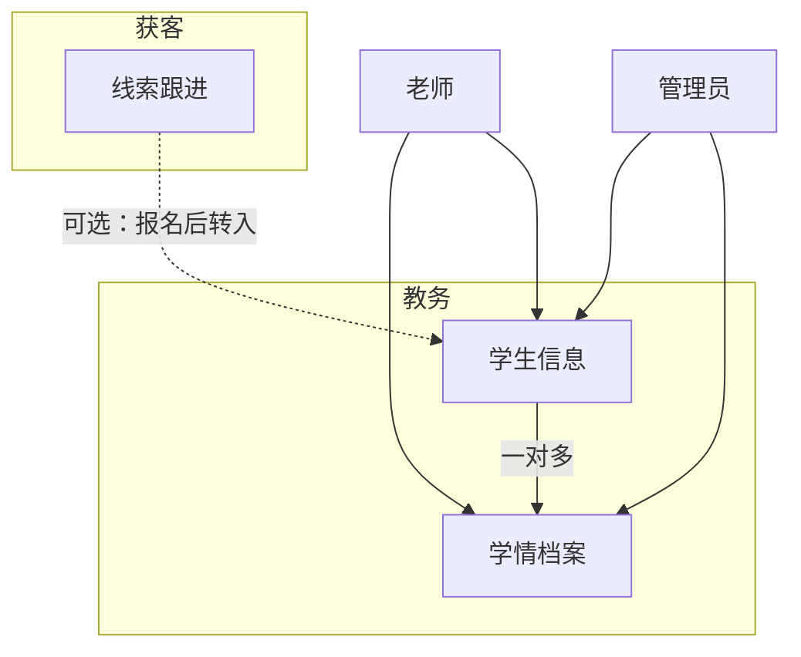

# 学生信息与学情档案 · 设计规格（V1.1 草案）

**日期：** 2026-07-29  
**状态：** 草案 · 待用户确认后实现  
**父规格：** `2026-07-28-one-class-ops-platform-design.md`  
**需求条目：** `REQ-STU-*` / `REQ-LRN-*`（见 `docs/requirements.md`）

---

## 1. 背景：你在要什么

当前系统主闭环是 **运营获客**（素材 → 文案/海报 → 线索）。  
你新增的诉求是 **教学服务闭环**：

1. 维护 **在读/在管学生**（姓名、年级、联系方式）  
2. 老师针对某学生 **录入学情档案**（上课状态、学习情况、图片、备注）  
3. 后台可 **筛选/搜索学生**，方便追踪与后续定制化服务  

这是从「招生工具」走向「小而美的教务轻量台」的关键一步。

---

## 2. 关键概念：线索 ≠ 学生

| | **线索 Lead** | **学生 Student** |
|--|---------------|------------------|
| 业务阶段 | 未成交 / 跟进中 | 已入学或确定要管的学员 |
| 目标 | 转化报名 | 学习追踪、家校服务 |
| 典型字段 | 来源、介绍人、需求、下次跟进 | 年级、在读状态、负责老师 |
| 现有表 | `leads` 已有 | **新建** `students` |

**不要** 把学生做成线索的一个 `status` 或标签——字段与权限会互相污染。  
**可以** 在导航上把两者放在同一父菜单下（你说的「线索里的子目录」），这是 **信息架构**，不是 **同一张表**。

推荐关系（可选、V1.1 可做可延后）：

```text
线索 status=enrolled  → 一键「转为学生」→ 创建 students 行，可选 source_lead_id
```



---

## 3. 导航与信息架构（对应「线索子目录」）

### 3.1 电脑后台（admin / operator）

侧栏把原来的单一「线索」升级为 **父级分组**（Element Plus 可折叠子菜单）：

```text
获客与学员
  ├─ 线索跟进     /leads          （现有 LeadListView）
  └─ 学生信息     /students       （新建）
```

- 路由仍独立：`/leads`、`/students`、`/students/:id`  
- 「学生信息」页：列表 + 筛选 + 新建/编辑；详情页看基础资料 + 学情时间线  
- **operator** 建议：可查看学生与学情（方便运营写进步文案时对照）；**写学情** 以 teacher/admin 为主（可配置，默认 operator 只读学情、可编辑学生基础信息——见权限表）

### 3.2 老师手机端（扩展现有 MobileLayout）

现有底栏仅 2 项：`上传 | 我的素材`。教学能力加入后，**推荐 4 个底栏**（教育 App 常见密度，可接受）：

```text
上传 | 素材 | 学生 | 学情
```

| Tab | 路径 | 作用 |
|-----|------|------|
| 上传 | `/m/upload` | 现有：交运营素材 |
| 素材 | `/m/materials` | 现有：我的素材 |
| 学生 | `/m/students` | 学生列表（搜索）→ 点进详情 |
| 学情 | `/m/learning` | 「写学情」快捷入口 + 我提交的最近记录 |

**为何不把学情塞进「学生」一个 Tab？**  
- 课后 30 秒录入：需要 **少步骤** 的「写学情」主按钮  
- 「学生」Tab 偏浏览/建档；「学情」Tab 偏高频提交  

若你觉得 4 个底栏挤，**备选 B（3 Tab）**：

```text
上传 | 素材 | 教学
```

「教学」页内再分 Segment：`学生列表 | 写学情 | 我的记录`。  
**推荐默认 A（4 Tab）**，信息更直白。

---

## 4. 数据模型（V1.1 最小集）

### 4.1 students

| 字段 | 类型 | 说明 |
|------|------|------|
| id | int | PK |
| name | str | 学生姓名（必填） |
| grade | str | 年级：如 `小一`…`初三`/`高一`… 或自由文本 + 推荐枚举 |
| phone | str? | 联系电话（多为家长手机） |
| parent_name | str? | 家长称呼（可选，V1.1 建议有） |
| status | str | `active` 在读 / `paused` 暂停 / `graduated` 结业 / `quit` 退学 |
| assigned_teacher_id | int? | 主责老师（users.id, role=teacher） |
| source_lead_id | int? | 可选：从哪条线索转入 |
| notes | text | 备注（过敏、偏好、沟通注意等） |
| created_by | int | 创建人 |
| created_at / updated_at | datetime | |

**索引：** grade、name、phone、assigned_teacher_id、status。

### 4.2 learning_records（学情档案）

| 字段 | 类型 | 说明 |
|------|------|------|
| id | int | PK |
| student_id | int | FK → students |
| teacher_id | int | 提交老师 |
| class_date | date/datetime | 上课日期（默认今天） |
| class_status | str | `attended` 已上课 / `absent` 缺勤 / `late` 迟到 / `leave` 请假 / `makeup` 补课 |
| subject | str? | 科目（可选，可与素材科目对齐） |
| learning_summary | text | 学习情况（主文） |
| homework_note | text? | 作业/下次建议（可选） |
| notes | text | 内部备注 |
| created_at / updated_at | datetime | |

### 4.3 learning_record_files

与 `material_files` 同模式：`record_id`、`file_path`、`file_type`、`sort_order`。  
复用现有 Storage + 鉴权下载。

### 4.4 状态与枚举（产品文案）

| class_status | 展示 |
|--------------|------|
| attended | 已上课 |
| absent | 缺勤 |
| late | 迟到 |
| leave | 请假 |
| makeup | 补课 |

---

## 5. 权限矩阵

| 能力 | admin | operator | teacher |
|------|:-----:|:--------:|:-------:|
| 学生列表/搜索/筛选 | 全部 | 全部 | **全部在读学生**（V1.1 简化；以后可「仅自己负责」） |
| 新建/编辑学生 | ✓ | ✓（建议） | ✓ |
| 停用/结业学生 | ✓ | ✓ | 仅自己创建的或自己负责的（简化：✓ 全部 active 可改 status） |
| 删除学生 | ✓ | ✗ | ✗ |
| 查看学情 | 全部 | 全部 | 全部（便于代课了解）或仅自己提交（二选一，**推荐全部可读**） |
| 新建/编辑学情 | ✓ | ✗ 或只读 | ✓（仅自己提交的可改） |
| 删除学情 | ✓ | ✗ | 仅自己的且 24h 内（可选） |

**V1.1 推荐默认（实现简单、够用）：**

- 学生：admin / operator / teacher 均可 CRUD（删除仅 admin）  
- 学情：teacher + admin 可写；operator 只读  
- 老师可见 **全部学生**（小机构人少；以后再加「负责老师」过滤）

---

## 6. 页面设计

### 6.1 电脑端 · 学生信息 `/students`

```text
┌─────────────────────────────────────────────────────────┐
│ 学生信息                          [+ 新建学生]            │
├─────────────────────────────────────────────────────────┤
│ 年级[全部▼]  状态[在读▼]  姓名[____]  电话[____]  [查询]  │
├─────────────────────────────────────────────────────────┤
│ 表格：姓名 | 年级 | 电话 | 主责老师 | 状态 | 最近学情 | 操作 │
│ 操作：详情 | 写学情 | 编辑                                 │
└─────────────────────────────────────────────────────────┘
```

**筛选（你点名的能力）：**

- 年级：下拉（多选可后做，先单选）  
- 姓名：模糊搜索  
- 联系电话：模糊/精确均可，建议 `contains`  
- 状态：默认「在读」  
- （增强）主责老师筛选 — admin 用  

**详情 `/students/:id`：**

- 上：基础资料卡片  
- 下：学情时间线（按 class_date 倒序）+ 「写学情」按钮  
- 可选：「关联线索」只读链接  

### 6.2 老师手机 · 学生 `/m/students`

```text
┌──────────────────┐
│ 🔍 搜姓名/电话    │
│ 年级 Chip 筛选    │
├──────────────────┤
│ 张小明  三年级    │
│ 138****0001  在读 │
├──────────────────┤
│ 李小红  …         │
└──────────────────┘
  右下 FAB：+ 新建学生
```

点卡片 → 详情：资料 + 最近 5 条学情 + 大按钮「写学情」。

### 6.3 老师手机 · 写学情 `/m/learning/new`（核心路径）

**原则：课后 1 分钟内完成。**

```text
1. 选择学生（搜索下拉，必填；从详情进入则预填）
2. 上课日期（默认今天）
3. 上课状态（大按钮单选：已上课/缺勤/请假…）
4. 学习情况（多行文本，必填）
5. 上传图片（0–9 张，复用素材上传组件风格）
6. 备注（可选）
7. [提交]
```

`/m/learning` 列表页：我提交的记录，可点进回看；顶栏「写学情」。

### 6.4 电脑端是否也要写学情？

要。admin（和可选 teacher 用电脑时）在学生详情点「写学情」打开 Dialog/抽屉，字段与手机一致。  
**不必** 给老师单独做一套桌面后台（继续强制 `/m/*` 即可）。

---

## 7. API 草案（`/api/v1`）

**students**

- `GET /students?grade=&name=&phone=&status=&q=`  
- `POST /students`  
- `GET /students/{id}`  
- `PATCH /students/{id}`  
- `DELETE /students/{id}`（admin）  
- `POST /leads/{id}/convert-to-student`（可选，V1.1 后半）

**learning-records**

- `GET /learning-records?student_id=&teacher_id=`  
- `POST /learning-records`（可 multipart 或先建再传文件）  
- `POST /learning-records/{id}/files`  
- `GET /learning-records/{id}`  
- `PATCH /learning-records/{id}`  
- `DELETE /learning-records/{id}`

权限与 materials 一致：JWT + 角色校验；文件下载走现有 `/files` 鉴权。

---

## 8. 与素材/文案的协同（可选增强）

学情里的「进步瞬间」图，未来可 **一键转素材**（带 student 年级科目），方便运营写小红书。  
**V1.1 不做**，只在规格里预留：`learning_record_id` → material 可选关联。

---

## 9. 非目标（本迭代不做）

- 完整排课课表、教室资源、课时包扣减  
- 家长端 App / 微信订阅消息推送学情  
- 成绩考试系统、作业批改  
- 复杂「仅看自己班级」多班级组织架构  
- 把学生塞进 leads 表混用  

---

## 10. 实现分期建议

| 阶段 | 内容 | 预估 |
|------|------|------|
| **P0** | students CRUD + 列表筛选 + 后台菜单「获客与学员」 | 先可建档可查 |
| **P0** | learning_records + 图片 + 老师端「学生/学情」两 Tab | 主闭环 |
| **P1** | 学生详情时间线、线索转学生、工作台「今日有课/近 7 日无学情」 | 可用性 |
| **P2** | 负责老师过滤、学情导出、转素材 | 增强 |

---

## 11. 验收清单（手工）

1. admin 新建学生（姓名+年级+电话），列表可按年级/姓名/电话筛出。  
2. teacher 手机端看到该学生，提交一条学情（已上课 + 文字 + 1 图）。  
3. admin 在学生详情看到该条学情与图片。  
4. operator 能打开学生列表；写学情按钮按权限隐藏或只读。  
5. 删除学生仅 admin；teacher 不能删他人学情（按最终权限表）。  
6. 侧栏「获客与学员」下线索与学生信息互不影响数据。  

---

## 12. 待你确认的决策点

| # | 问题 | 推荐默认 |
|---|------|----------|
| 1 | 导航文案 | 父菜单「获客与学员」，子项「线索跟进」「学生信息」 |
| 2 | 老师底栏 | 4 Tab：上传 / 素材 / 学生 / 学情 |
| 3 | 老师可见学生范围 | V1.1 全部学生；以后再「仅负责」 |
| 4 | operator 学情权限 | 只读 |
| 5 | 线索转学生 | P1 再做，P0 可手建学生 |
| 6 | parent_name 字段 | 要，和 phone 一起 |

确认后即可按 `REQ-STU-*` / `REQ-LRN-*` 开工实现。
