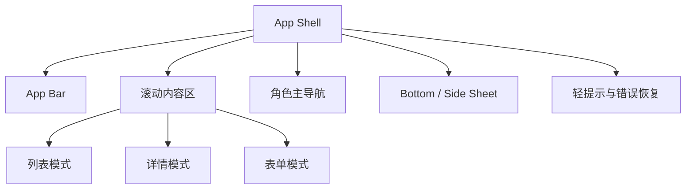
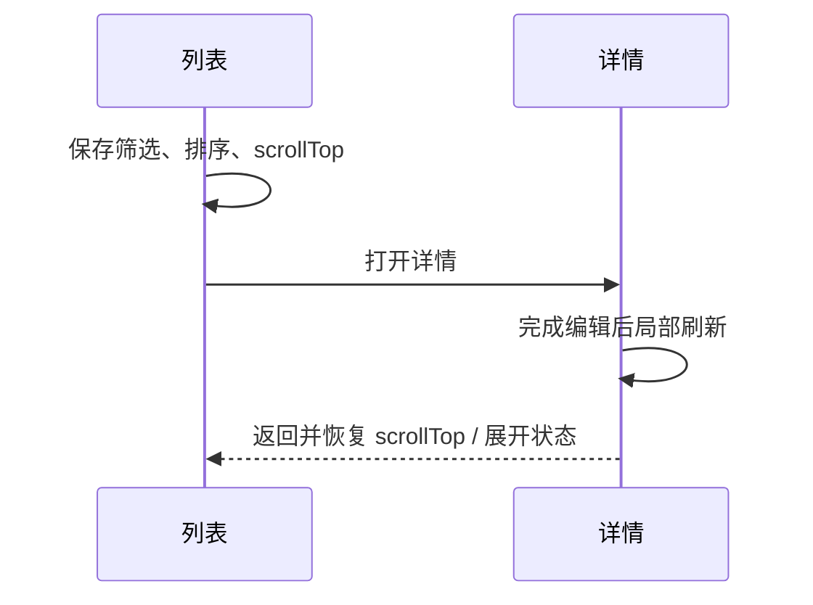

# 嘉壹启航 WAP / Pad 应用化重构方案（评审稿）

> 版本：v1.0 · 2026-08-08  
> 目标：把现有“PC 页面缩小版”改成面向触控设备的业务应用。  
> 本文是设计与交互方案，当前不改业务页面代码；确认方向后按阶段实施。

## 0. 先说结论

这次不建议继续给每个 PC 页面补几条 `@media`。推荐采用 **一套业务数据与路由 + 两套应用壳层 + 一套统一的移动页面模式**：

1. 手机（WAP）使用单列、底部主导航、全屏详情和底部筛选面板。
2. Pad 使用持久化侧边栏/图标轨、列表-详情双栏和更高的信息密度；不再把 Pad 当作手机放大版。
3. 所有模块统一“页面头部、搜索筛选、卡片列表、详情分区、底部操作栏、加载/空态/错误态”的规则。
4. 高频任务优先：**今日课表/点名、线索跟进、学员查看、录学情、报名续费、素材上传**。
5. 保留现有 PC 体验，移动端通过共享 API 和 composable 重做展示层，不新增一套 `/m` 业务路由。

最终效果应当接近一个业务 App：打开就能做事，主要操作在拇指可达范围，复杂内容分层而不是一次性堆在屏幕上。

---

## 1. 当前问题诊断

### 1.1 断点把手机和 Pad 合并了

现有 `useBreakpoint` 将 `<=991px` 统一标记为 `isCompact`，虽然额外计算了 Pad 横竖屏，但页面多数只判断 `isCompact`。结果是：Pad 仍使用手机卡片、底部抽屉和单列逻辑，横屏空间没有被利用。

参考：`frontend/src/composables/useBreakpoint.ts`。

### 1.2 导航不是完整的 App 导航

现在只有“纯老师且无额外权限”会显示底部 Tab；其他角色主要通过左上角打开抽屉。高频模块之间需要反复打开菜单，且抽屉承载了过多层级。

参考：`frontend/src/layouts/AppLayout.vue` 的 `showTeacherTabBar`、`teacherTabs` 和移动端 `el-drawer`。

### 1.3 移动端已有零散组件，但没有统一页面系统

项目已经有 `CompactFilterBar`、`MobileFilterSheet`、`MobileActionBar`、`AppSheet` 和部分卡片/无限滚动实现，这是很好的基础；但不同页面的标题、筛选、卡片展开、详情入口、操作按钮和弹层尺寸仍各自实现。

结果是用户在不同模块中需要重新学习交互。

### 1.4 详情页仍然偏桌面

学员、线索、订单、课表记录等详情页仍大量使用 `el-descriptions`、`el-table`、多按钮工具栏和长标签页。即使做了列数收缩，信息层级仍是“桌面详情压缩后塞进手机”。

移动端需要改成“身份摘要 → 关键指标 → 业务动作 → 时间线/分区”的阅读顺序。

### 1.5 复杂表单和弹窗边界不清

短确认适合弹窗，长表单适合独立页面，筛选适合底部 Sheet，选项较多时适合全屏选择器。当前这些场景混用，容易出现弹窗过高、按钮贴边、键盘遮挡和多层弹层。

### 1.6 `/m` 已经退化成重定向

路由中的 `/m/*` 只是兼容入口并重定向到正式路由，说明“独立移动壳”没有持续演进。建议保留兼容重定向，但不再以 `/m` 作为新架构边界。

---

## 2. 设计目标与不做什么

### 2.1 目标

- **三秒找到入口**：进入工作台后能看到下一件最重要的事。
- **单手可操作**：主要按钮、Tab 和确认操作满足 44–48px 触控尺寸。
- **少跳转、可回退**：短任务在 Sheet 完成，长任务才进入详情页；返回列表恢复原滚动位置。
- **信息分层**：首屏只放决定下一步所需的信息，完整信息在分区或二级页面中展开。
- **网络不稳定也可用**：列表分页追加、局部刷新、失败重试，不因一次请求失败清空整页。
- **角色适配**：老师、CR、运营、负责人看到的主导航和首页重点不同。
- **与 PC 一致但不复制 PC**：业务名词、颜色和权限一致，布局与交互针对触控重做。

### 2.2 不做什么

- 不把所有 PC 表格简单改成横向滚动。
- 不在手机上同时显示所有筛选字段。
- 不为每个模块再建一套 `/m` 数据接口和路由。
- 不用大量动画或装饰牺牲加载速度和可读性。
- 不把“点击卡片展开”当作所有详情场景的唯一入口；复杂操作应进入完整详情。

---

## 3. 设备策略：手机、Pad、桌面三种模式

推荐将当前断点升级为明确的 `deviceMode`，而不是只暴露一个 `isCompact`：

| 模式 | CSS 宽度 | 典型设备 | 页面策略 |
|---|---:|---|---|
| `phone` | `<=767px` | 手机竖屏、窄 WebView | 单列、底部 Tab、全屏详情、底部 Sheet、无限滚动 |
| `pad-portrait` | `768–899px` | iPad 竖屏、小平板 | 单列/双列卡片、持久化图标轨、底部或右侧 Sheet |
| `pad-landscape` | `900–1199px` | iPad 横屏、Android 平板 | 左侧图标轨 + 双栏列表/详情，重要信息并排 |
| `desktop` | `>=1200px` | PC 浏览器 | 保留现有侧栏、表格和 PC 分页 |

补充判断：结合 `orientation`、`pointer: coarse` 和 `hover: none`，避免触屏平板误走桌面 hover 交互；断点只负责布局，权限仍由现有 auth store 决定。

### 3.1 关键尺寸

| 项目 | 手机 | Pad |
|---|---:|---:|
| 顶部 App Bar | 56px | 56px |
| 底部主导航 | 64px + safe area | 默认不显示；竖屏可选 |
| 页面水平内边距 | 16px（极窄屏 12px） | 20–24px |
| 触控目标最小尺寸 | 44px | 44px |
| 卡片圆角 | 14px | 14px |
| 卡片间距 | 10–12px | 12–16px |
| 底部 Sheet 最大高度 | 82dvh | 72dvh（横屏右侧 Sheet 可用 420–480px） |

---

## 4. 应用壳层（App Shell）

### 4.1 手机壳

```text
┌────────────────────────────────┐
│ 〈  页面标题              搜索/更多 │  ← 56px App Bar
├────────────────────────────────┤
│  页面内容：卡片、时间线、表单       │
│                                  │
│                         ＋         │  ← 仅在有上下文动作时显示 FAB
├────────────────────────────────┤
│ 工作台   线索/课表   学员   学情   更多 │  ← 64px Tab Bar
└────────────────────────────────┘
```

- 根页面显示“模块标题”，详情页面显示返回按钮 + 实体名称。
- 顶部右侧只保留当前页面最常用的 1–2 个动作；其余收进“更多”。
- 底部 Tab 由角色配置，固定 4 个业务入口 + 1 个“更多”，不把所有菜单平铺。
- 键盘弹出时自动隐藏 FAB 和底部导航，避免遮挡输入框。
- 支持系统返回键/手势：先关闭 Sheet/键盘，再返回上一级。

### 4.2 Pad 壳

```text
┌──────┬──────────────────────────────────────────┐
│  Logo│ 〈 学员                         搜索 头像 │  ← 顶部 App Bar
│  主页├───────────────────┬──────────────────────┤
│  线索│  搜索/筛选/排序     │  学员摘要             │
│  教务│  ┌──────────────┐  │  关键动作             │
│  财务│  │列表卡片       │  │  分区 / 时间线        │
│  内容│  │列表卡片       │  │                      │
│  更多│  └──────────────┘  │                      │
└──────┴───────────────────┴──────────────────────┘
```

- `pad-landscape` 默认保留 72px 图标轨；可手动展开为 216–232px 标签轨。
- 列表 → 详情优先使用同页双栏；从详情返回只改变右栏，不丢左栏筛选和滚动位置。
- `pad-portrait` 默认单栏，但可使用两列卡片网格；长表单可使用 2 列字段。
- Pad 不使用“手机底部 Tab + PC 侧栏”混搭；只选择一套主导航。

### 4.3 全局层级



只允许一层主 Sheet + 一层确认框；禁止多个可滚动容器互相嵌套导致“滑不动”。

---

## 5. 信息架构与角色导航

### 5.1 主导航原则

导航不是把 PC 菜单搬到手机，而是按“今天要做什么”分组。每个角色最多 5 个底部入口，更多模块放入分组 Sheet。

| 角色 | 底部/主入口（推荐顺序） | 更多分组 |
|---|---|---|
| 老师 | 工作台、课表、学员、学情、更多 | 上传素材、素材库、班级记录、个人设置 |
| CR / 学管师 | 工作台、线索、学员、课表、更多 | 报名续费、学情、班级记录、素材 |
| 运营 | 工作台、线索、学员、财务、更多 | 教务、素材/文案/海报、知识库、用户 |
| 负责人 / Admin | 工作台、教务、财务、获客、更多 | 内容中心、用户权限、综合办公、个人设置 |

### 5.2 “更多”面板

“更多”不是二级侧栏，而是带分组标题的入口面板：

- 最近使用：最近 3 个模块。
- 获客与学员：线索、学员、报名续费。
- 教务：班级、课表、上课记录、课程、老师、学情。
- 内容：上传、素材、文案、海报、模板、GPT 生图。
- 财务：订单、收支明细、课消、充值、收入报告。
- 系统：知识库、综合办公、用户、密码与退出。

每个入口显示图标、名称和一行作用说明；有待处理事项时显示数字角标。

### 5.3 首页按角色换重点

#### 老师首页

1. 下一节课（时间、班级、教室、点名按钮）。
2. 今日课表时间线。
3. 待录学情学生/今日待办。
4. 快捷操作：点名、录学情、查学员、上传素材。

#### CR / 运营首页

1. 今日待跟进线索（按下一次跟进时间排序）。
2. 今日上课与待点名。
3. 报名/续费和欠费提醒。
4. 学员异常（停课、课时不足、长期未记录）。

#### 负责人首页

1. 经营 KPI 横向摘要。
2. 需要审批/确认的事项。
3. 财务和教务异常。
4. 团队任务与最近活动。

首页不展示 PC 版的大面积欢迎横幅和三列空白区；所有首屏卡片都必须能点进具体工作。

---

## 6. 统一页面模式

### 6.1 列表页：搜索 → 筛选 → 卡片 → 无限加载

```text
┌────────────────────────────────┐
│ 〈 学员                         ＋ │
├────────────────────────────────┤
│ 🔍 搜索姓名、电话、学校           │  ← 可直接输入
│ 128 位学员                 筛选 2 │  ← sticky summary
│ [在读] [高中] [学管师：李老师]      │  ← 横向滚动 chips
├────────────────────────────────┤
│ ◎ 林同学              在读   ›    │
│   高一 · XX学校 · 最近学情 昨天     │
├────────────────────────────────┤
│ ◎ 陈同学              试听   ›    │
│   初三 · XX学校 · 待跟进 明天       │
├────────────────────────────────┤
│          上拉加载更多              │
└────────────────────────────────┘
```

规则：

- 手机/Pad 不默认展示复选框；点击“选择”后进入批量模式，顶部变为“已选 N”，底部出现批量操作栏。
- 卡片首行只放身份、状态和箭头；次行放 2–3 个最有用的元数据；其余信息在详情页。
- 点击卡片进入详情；点击电话、跟进、点名等快捷动作时使用明确的按钮，不把整张卡变成多个隐形热区。
- 采用服务端分页 + 追加加载；每次追加 20 条，底部显示加载中/已全部加载/重试。
- 下拉刷新只刷新当前查询，不清空已显示列表，失败时保留旧数据并显示重试条。
- 列表离开详情后恢复滚动位置和筛选；切换到其他模块则清理快照。

### 6.2 详情页：身份摘要 → 关键动作 → 分区 → 时间线

```text
┌────────────────────────────────┐
│ 〈 学员详情              ⋯       │
├────────────────────────────────┤
│ [头像] 林同学       在读         │
│ 高一 · XX学校                    │
│ [录学情] [报名/续费] [联系家长]    │  ← 首屏动作
├────────────────────────────────┤
│ 概览  学习  课程/订单  动态        │  ← 3–4 个短 Tab
├────────────────────────────────┤
│ 关键指标                         │
│ 剩余课时 24   最近上课 昨天        │
├────────────────────────────────┤
│ 学情时间线                       │
│ ● 8月8日  数学 · 已完成           │
│ ● 8月6日  英语 · 待补充           │
└────────────────────────────────┘
```

- `el-descriptions` 仅用于 Pad 横屏的补充信息；手机改成键值行/信息卡。
- 详情动作按风险分级：主操作直接显示，编辑/转交/作废放入右上角“更多”，删除永不与主操作并排。
- 长列表分区默认折叠，展开后在同一滚动容器内滚动；不要在卡片里再嵌套完整表格。
- 从列表进入的详情需要携带来源 route；返回使用 `router.back()` 并恢复列表快照。

### 6.3 表单页：分组、草稿、固定提交

- 4 个字段以内：可用 Sheet 或短弹窗。
- 超过 4 个字段、涉及文件或多步确认：使用全屏表单页。
- 标签置顶、输入框高度 48px；必填项统一使用红色星号和行内错误。
- 长表单分为“基本信息 / 业务信息 / 备注与附件”，顶部显示步骤或分段锚点。
- 底部固定操作栏：取消/返回 + 保存；提交中按钮只显示一个 loading 状态。
- 离开前检测未保存内容，提供“保存草稿 / 放弃 / 继续编辑”。

### 6.4 筛选：草稿态 Sheet + 应用态查询

```text
┌────────────────────────────────┐
│     ───  筛选条件        重置     │
├────────────────────────────────┤
│ 搜索                            │
│ [姓名 / 电话                 ]   │
│ 状态                            │
│ [在读] [停课] [已毕业]            │
│ 年级                            │
│ [选择年级                    ›]   │
│ 学管师                          │
│ [选择负责人                  ›]   │
├────────────────────────────────┤
│              查看 128 条结果       │  ← 固定 footer
└────────────────────────────────┘
```

- 打开 Sheet 时复制一份 draft filters；只有点击“查看结果”才发请求。
- 已应用条件显示为可删除 chip，筛选按钮显示活动数量。
- 选项超过 8 个时进入二级全屏选择器，支持搜索和单选/多选，不在 Sheet 内塞长下拉。
- 日期统一提供快捷项：今天、近 7 天、本月、自定义。
- Pad 横屏可将 Sheet 放到右侧；手机和 Pad 竖屏从底部上滑。

### 6.5 弹窗、Sheet 与确认框

| 场景 | 组件形态 | 规则 |
|---|---|---|
| 删除、作废、退出 | 居中确认框 | 说明后果；危险按钮右侧；不可误触 |
| 快速查看/选择少量内容 | Bottom Sheet | 顶部标题、拖拽条、内容滚动、固定 footer |
| 筛选 | Filter Sheet | draft/apply/reset 三段式 |
| 课程/学员等长选项 | 全屏 Picker | 搜索、分组、最近使用、确定 |
| 复杂编辑表单 | 全屏页面 | 顶部返回、底部保存，不放在小弹窗里 |
| 图片/海报预览 | 全屏预览 | 双指缩放、左右切换、下载/分享 |

统一约束：遮罩层不滚动、标题和 footer 固定、内容区单独滚动、最多两层弹层、适配 safe-area 和键盘。

---

## 7. 重点模块交互方案

### 7.1 工作台

**手机**：只保留“今日 / 待办 / 快捷操作 / 最近活动”四块；下一节课和待跟进置顶。  
**Pad**：左侧今日时间线，右侧 KPI 与任务卡；支持横向切换“今天/本周”。

待办卡片点击后直接跳到对应业务动作；超过 6 条显示模块内滚动，不让首页无限变长。

### 7.2 课表与点名（P0）

- 顶部：日期横向滑动条 + “日视图 / 周视图”切换。
- 手机默认日视图，课程按时间线排列；当前课程高亮并显示倒计时。
- Pad 横屏默认周视图，左侧时间轴、右侧 3–7 天网格；支持缩放行高。
- 点击课程先出快速 Sheet：班级、老师、教室、学生数、点名/查看记录。
- 点名进入全屏“名单模式”：顶部显示已到/缺席/请假计数，底部固定“提交点名”；支持全到、批量状态、搜索学生。
- 点名提交后即时更新待办和课表状态；失败保留本地勾选，不丢操作。

### 7.3 学员（P0）

- 列表卡：头像/姓名/年级、在读状态、学管师、最近学情；右侧箭头。
- 详情首屏动作：联系家长、录学情、报名/续费；电话使用 `tel:`，不把号码当纯文本。
- 详情 Tab 建议压缩为：概览、学习、课程/订单、动态；课程包和订单改成信息卡。
- 学员编辑使用全屏表单；删除/转交进入选择模式 + 底部批量栏。

### 7.4 学情（P0）

- 列表按日期/学生分组，优先显示“待补充”和最近记录。
- 新建学情分两步：选择学生 → 记录课堂情况；学生选择支持最近使用和搜索。
- 文本输入支持模板短语；图片附件显示上传队列、失败重试和压缩进度。
- 详情使用时间线，不使用长表格；编辑和删除放在“更多”。

### 7.5 线索（P0）

- 顶部提供状态分段：全部 / 待联系 / 已联系 / 已到访 / 已报名；横向滚动。
- 卡片首行：姓名 + 状态；次行：来源、电话、负责人；第三行：下次跟进时间和提醒色。
- 卡片快捷动作：拨号、写跟进、改状态；滑动删除/转交不作为默认手势，避免误操作。
- 详情首屏显示“下一步跟进”而不是完整字段表；动态时间线按最新在前。
- 新建/编辑分成“基本资料”和“跟进计划”；保存后自动刷新列表和待办。

### 7.6 报名/续费与财务（P0/P1）

- 报名续费采用 4 步流程：学员 → 课程/课包 → 金额/优惠 → 确认提交。
- 每一步都可返回，不清除已填写内容；最后一步用清晰的应收/实收/欠费对账卡。
- 订单详情：金额状态摘要、项目明细、付款时间线、操作日志；作废放右上角更多并二次确认。
- 收支/课消/充值列表采用金额突出卡片；正负金额、已确认/待确认状态使用固定颜色语义。
- 收入报告在手机上先展示 KPI 和趋势摘要，明细表改为“按日展开”的列表。

### 7.7 素材、文案、海报、模板（P1）

- 图片/海报/模板默认网格（手机 2 列，Pad 3–4 列），文案默认列表。
- 图片卡只显示缩略图、标题、更新时间和状态；点击进入全屏预览，再进入编辑。
- 上传使用“选择来源 → 上传队列 → 编辑元数据 → 完成”流程；支持相册、相机和文件。
- 文案生成采用“输入需求 → 生成中 → 结果对比 → 复制/保存”四步；结果卡支持横向切换版本。
- 批量删除/下载统一进入选择模式，不在每张卡上常驻危险按钮。

### 7.8 班级、课程、老师、上课记录（P1）

- 班级详情首屏：班级状态、课程、老师、上课时间、学生数；学生名单为可搜索卡片。
- 课程/老师列表使用实体卡；新建/编辑全屏表单。
- 上课记录列表使用日期分组时间线；记录详情显示点名汇总和备注。
- Pad 横屏可在名单和记录之间双栏切换；手机以 Tab/Accordion 分层。

### 7.9 知识库、综合办公、用户（P2）

- 知识库：分类 Tab + 搜索 + 文章卡，打开后支持复制话术/收藏。
- 综合办公：工具图标网格，工具结果在 Sheet 或独立页面展示，不嵌套 PC 表格。
- 用户：头像、姓名、角色、状态卡；权限编辑进入全屏分组选择器，保存前显示变更摘要。

---

## 8. 视觉方向

保留现有“米金轻奢”品牌识别，但在移动端减少大面积渐变和装饰，提升对比度和操作反馈。

### 8.1 颜色 Token

| Token | 建议值 | 用法 |
|---|---|---|
| `--oc-page-mobile` | `#F7F4EE` | 页面背景 |
| `--oc-card` | `#FFFCF7` | 卡片/Sheet |
| `--oc-ink` | `#292524` | 主文字 |
| `--oc-muted` | `#78716C` | 辅助文字 |
| `--oc-primary` | `#A16207` | 主操作、选中 |
| `--oc-success` | `#16A34A` | 已完成/正常 |
| `--oc-warning` | `#D97706` | 待跟进/提醒 |
| `--oc-danger` | `#DC2626` | 删除/作废/异常 |
| `--oc-info` | `#2563EB` | 链接/信息 |

### 8.2 字体与间距

- 页面标题 18px / 700；卡片标题 16px / 650；正文 14px；辅助 12px。
- 单个卡片最多 3 个信息层级；超过 2 行的标题省略并在详情完整展示。
- 统一 4px 基础间距，常用间距为 8 / 12 / 16 / 24px。
- 触控反馈使用轻微背景变化和 120–180ms 过渡，不使用大幅位移。
- 状态不只靠颜色，同时显示文字或图标，保证可读性。

---

## 9. 组件与技术拆分

### 9.1 建议新增的基础组件

```text
src/components/app/
  AppMobileShell.vue       # 手机顶部栏 + 底部导航 + safe-area
  AppPadShell.vue          # Pad 图标轨/展开轨 + 双栏容器
  AppPageHeader.vue        # 返回、标题、右侧动作
  AppTabBar.vue            # 角色主导航
  AppRail.vue              # Pad 导航轨
  AppSearchBar.vue         # 搜索、清除、提交策略
  AppFilterBar.vue         # 结果摘要 + chips + 筛选入口
  AppFilterSheet.vue       # draft/apply/reset
  AppListCard.vue          # 列表卡基础布局
  AppDetailSection.vue     # 详情分区/Accordion
  AppTimeline.vue          # 动态、学情、操作日志
  AppPicker.vue             # 长选项全屏选择器
  AppFormFooter.vue         # 固定提交栏
  AppStateView.vue          # loading/empty/error/retry
  AppPreviewViewer.vue      # 图片/海报全屏预览
```

现有 `AppSheet`、`MobileFilterSheet`、`MobileActionBar`、`CompactFilterBar` 可以逐步迁移为这些组件的兼容实现，不一次性删除。

### 9.2 断点 API

将 `useBreakpoint()` 增加以下结果，旧字段先保留兼容：

```ts
type DeviceMode = 'phone' | 'pad-portrait' | 'pad-landscape' | 'desktop'

return {
  mode,
  isApp: computed(() => mode.value !== 'desktop'),
  isPhone,
  isPad,
  isPadPortrait,
  isPadLandscape,
  isDesktop,
  orientation,
}
```

页面只在确实需要不同信息结构时使用 `mode` 分支；纯间距、列数和显隐优先用 CSS，避免首帧闪烁。

### 9.3 路由元信息

建议给现有路由增加展示元数据，而不是新增 `/m` 路由：

```ts
meta: {
  mobileTitle: '学员',
  mobileTab: 'students',
  mobileParent: '/students',
  mobilePresentation: 'list' | 'detail' | 'form' | 'workspace',
  preserveScrollKey: 'students',
}
```

`AppLayout` 根据元信息处理顶部标题、返回行为、Pad 双栏和底部导航高亮。

### 9.4 数据与状态规则

- PC 使用当前服务端分页；手机/Pad 使用同一分页接口追加加载。
- 查询状态拆成 `draftFilters` 与 `appliedFilters`，防止筛选 Sheet 每次改变都请求。
- 列表状态（筛选、排序、滚动、展开项）按业务 key 存入 session snapshot。
- 详情中的局部更新只刷新相关 section，不整页 loading。
- 所有异步列表必须有 skeleton、空态、错误重试和“已加载全部”尾部状态。

---

## 10. 交互细节与边界

### 10.1 返回与滚动



- 详情返回列表恢复位置；切换到另一个一级 Tab 清理快照。
- Sheet 关闭后不改变主页面 scrollTop。
- 打开键盘时，输入框滚动到可视区；提交后恢复滚动。

### 10.2 加载、失败和离线感知

- 首次加载：显示与卡片结构一致的 skeleton，不使用整页白屏 spinner。
- 追加加载：只在列表尾部显示 spinner。
- 请求失败：保留旧数据，在顶部显示可关闭的重试条。
- 上传/点名/保存：按钮进入 loading，操作结果用 toast + 局部状态更新。
- 可选增强：将最近一次课表和待办缓存到 session，断网时显示“上次同步时间”。

### 10.3 手势边界

- 下拉刷新仅绑定页面主滚动容器，Sheet 和内部列表禁止触发页面刷新。
- 左滑操作只用于低风险动作（标记已读、归档）；删除、作废、转交必须显式确认。
- 长按进入批量选择前显示一次轻提示；Pad 不依赖长按，提供明确的“选择”按钮。
- 横向滚动只用于日期条、筛选 chips、媒体网格和 Pad 周课表；禁止正文横向滚动。

### 10.4 可访问性与安全区

- 所有图标按钮有 `aria-label` 和可见 tooltip（Pad/桌面）。
- 主要文本与背景对比度达到 WCAG AA；状态同时有文字。
- 底部 Tab、Sheet footer、FAB 均使用 `env(safe-area-inset-bottom)`。
- 点击危险动作前显示对象名称和后果；保存/作废按钮不使用相同颜色。

---

## 11. 迁移路线（按风险和价值排序）

### Phase 0：基础壳与规范

- 新增 `deviceMode`、App Bar、角色 Tab Bar、Pad Rail。
- 统一 Sheet、表单 footer、状态组件和触控尺寸。
- 建立页面快照/返回恢复和全局滚动规则。
- 不改业务 API，不影响 PC。

**验收**：四种设备模式切换不闪烁；不存在页面与内部容器双滚动；所有 Sheet footer 固定。

### Phase 1：老师高频闭环（最高优先级）

工作台 → 课表 → 点名 → 学员 → 录学情 → 上传素材。

**验收**：老师在手机上完成一次点名和录学情不超过 3 次页面跳转；返回后列表位置不丢；上传失败可重试。

### Phase 2：获客与教务

线索列表/详情、学员列表/详情、报名续费、班级、上课记录、课程/老师。

**验收**：搜索和筛选均在 Sheet 内完成；详情首屏能完成跟进/报名/查看记录；Pad 横屏出现列表-详情双栏。

### Phase 3：财务与内容

订单、收支、课消、充值、收入报告、素材、文案、海报、模板。

**验收**：金额、状态、确认/作废路径清晰；媒体列表无横向表格；生成/上传过程有队列状态。

### Phase 4：管理员与体验打磨

知识库、综合办公、用户权限、通知中心、最近使用、PWA manifest/安装提示（可选）。

**验收**：角色导航无越权入口；冷启动、弱网、旋转屏、键盘和系统返回均通过测试。

---

## 12. 评审时需要确认的 5 个产品决策

1. 手机底部主导航是否接受“角色动态 4 Tab + 更多”的方案？
2. Pad 横屏是否采用“左侧图标轨 + 列表/详情双栏”，而不是继续使用底部 Tab？
3. 老师首页第一优先级是否确定为“下一节课/点名”，CR/运营是否确定为“待跟进线索”？
4. 报名续费、点名、录学情是否同意改成全屏流程页，而不是长弹窗？
5. 第一阶段是否先只做老师闭环和通用壳，确认手感后再迁移财务/内容/管理员模块？

### 推荐的默认答案

如果没有额外偏好，建议直接采用：

- 动态角色导航；
- Pad 双栏壳；
- 手机卡片 + 无限加载；
- 筛选底部 Sheet、长选项全屏 Picker；
- 复杂表单全屏化；
- 先做 Phase 0 + Phase 1，再根据真实使用反馈调整其余模块。

这套方案可以在保留现有权限、接口和 PC 页面的前提下逐步上线，不需要一次性重写整个项目。

